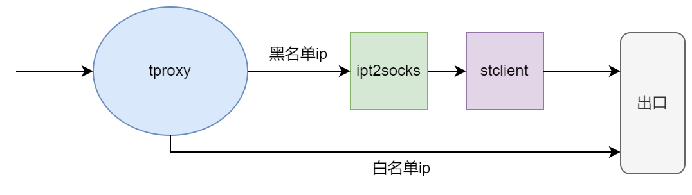

# tproxy
透明代理脚本，将通过本机的流量按规则分流，白名单直接走默认路由，黑名单走代理，客户端无感知，故称透明代理

 
## 使用方法
### 安装相关工具
1,[chinadns](https://github.com/0990/chinadns) 防污染dns解析工具，支持缓存 
2,[ipt2socks](https://github.com/zfl9/ipt2socks)  将iptables(REDIRECT/TPROXY)流量转换为socks5流量工具 
3,[stclient](https://github.com/0990/stunnel) 基于端口转发的加密安全通道的客户端，将普通流量转成加密流量 

### 启动tproxy
1,配置tproxy.conf，重点是force_chn_ip4(强制白名单),填上代理服务器地址 
2,启动,使用命令tproxy start 

